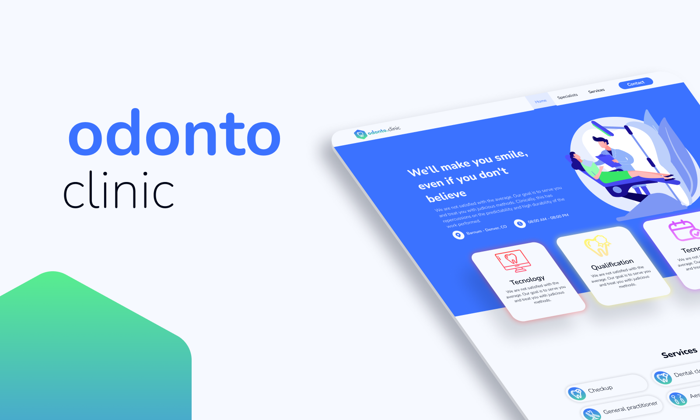

Aqui está um README mais detalhado para o projeto **Odonto Clinic**, incluindo informações adicionais e especificações sobre as tecnologias:

---

<h1 align="center">
    <strong>Odonto Clinic</strong>
</h1>

<p align="center">
    
</p>

## Sobre o projeto

**Odonto Clinic** é um website desenvolvido para uma clínica odontológica, visando melhorar a experiência dos pacientes e fornecer informações essenciais sobre os serviços oferecidos. O site foi projetado para ser visualmente atraente e intuitivo, permitindo que os usuários encontrem informações sobre os tratamentos, conheçam os especialistas, leiam depoimentos e localizem a clínica. A interface moderna e responsiva foi construída com foco em usabilidade e acessibilidade.

## 💻 Tecnologias e Dependências

Esse projeto foi desenvolvido com as seguintes tecnologias e bibliotecas:

| Tecnologias | Versão | Links |
|-------------|--------|-------|
| Vite        | ^5.2.0 | [Vite](https://vitejs.dev/guide/) |
| Chakra UI   | ^2.8.2 | [Chakra UI](https://chakra-ui.com/) |
| TypeScript  | ^5.2.2 | [TypeScript](https://www.typescriptlang.org/) |

### Principais Bibliotecas Utilizadas

- **Chakra UI v2**: Biblioteca de componentes estilizados que facilita a criação de interfaces acessíveis e responsivas. A versão 2 traz novas funcionalidades e melhorias em comparação com a versão anterior.
- **React Icons**: Para ícones vetoriais reutilizáveis em diferentes partes do layout.
- **Google Maps Integration**: Um mapa interativo para ajudar os usuários a localizar a clínica com facilidade.

## 🚀 Como rodar o projeto?

### Pré-requisitos

Certifique-se de ter os seguintes requisitos instalados:

- **[Node.js](https://nodejs.org/en/)** (versão LTS recomendada)
- **[Git](https://git-scm.com/)** para clonar o repositório
- Um gerenciador de pacotes: **npm** (instalado com o Node.js) ou **[Yarn](https://www.npmjs.com/package/yarn)**

### 1. Clonando o repositório

Clone o projeto para sua máquina local:

```bash
git clone https://github.com/KayoRonald/odonto-clinic/
```

### 2. Navegando para o diretório do projeto

Abra o terminal e vá para o diretório do projeto:

```bash
cd odonto-clinic
```

### 3. Instalando as dependências

Instale todas as dependências do projeto usando **yarn** ou **npm**:

```bash
# Usando yarn
yarn

# Usando npm
npm install
```

### 4. Rodando a aplicação

Inicie o servidor de desenvolvimento com o comando:

```bash
# Usando yarn
yarn dev

# Usando npm
npm run dev
```

A aplicação estará disponível no endereço `http://localhost:5173/` ou em outra porta definida pelo Vite.

## 📋 Funcionalidades

- Página inicial com informações sobre os serviços e especialidades
- Seção de depoimentos de clientes
- Mapa interativo com a localização da clínica
- Layout responsivo para uma melhor experiência em dispositivos móveis
- Integração com o Chakra UI v2 para uma interface mais moderna e estilizada


  <a href="https://skillicons.dev">
    
  </a>

## 📝 Licença

Este projeto está sob a licença MIT. Veja o arquivo **[LICENSE](LICENSE)** para mais detalhes.
